\vspace{-2em}
\begin{center}
{\small GitHub: \url{https://github.com/Dzw310/STAT-GR5243-Project-4}}\\[0.2em]
{\small Web App: \url{https://zd2372.shinyapps.io/loan-default-predictor/}}
\end{center}
\vspace{1em}

# 1. Introduction and Dataset Description

## 1.1 Problem Statement

LendingClub, the largest peer-to-peer lending platform in the United States, facilitated approximately 2.3 million loans between 2007 and 2018. In peer-to-peer lending, individual investors fund loans directly, bearing the full credit risk of borrower default. Approximately 20% of completed loans ended in default ("Charged Off"), resulting in significant financial losses for investors. The ability to predict which loans will default at the time of origination is therefore critical for both platform risk management and individual investment decisions.

This project builds an end-to-end machine learning pipeline to predict whether a LendingClub loan will default, covering the full data science lifecycle: data cleaning, exploratory analysis, unsupervised learning, feature engineering, supervised modeling, model comparison, and deployment as an interactive web application.

## 1.2 Dataset Overview

The primary dataset is the **LendingClub Loan Data (2007–2018 Q4)**, sourced from Kaggle. It comprises two files:

- **Accepted loans**: 2,260,701 records with 151 features covering loan terms, borrower demographics, credit history, and payment outcomes.
- **Rejected applications**: 27.6 million records with 9 columns (Amount Requested, Risk Score, Debt-to-Income Ratio, State, Employment Length, etc.), used for comparative analysis.

The accepted loans dataset presents significant data complexity: 151 raw columns span structured numeric, categorical, date, and free-text fields. Many columns contain substantial missing values (up to 100% null in joint-application and hardship fields), mixed data types (e.g., `int_rate` stored as `"14.5%"` strings), and multiple encoding inconsistencies. This complexity makes the dataset well-suited for demonstrating advanced data cleaning, feature engineering, and modeling techniques.

We frame this as a **binary classification** problem. From the seven `loan_status` categories, we retain only terminal outcomes: **Fully Paid** (class 0) and **Charged Off** (class 1, "default"). After filtering, the working dataset contains **1,345,310 loans** with a **19.96% default rate**, creating a moderately imbalanced classification problem.

# 2. Data Acquisition Methodology

The dataset was obtained from the public Kaggle repository [*Lending Club Loan Data*](https://www.kaggle.com/datasets/wordsforthewise/lending-club). The two CSV files total approximately 3.5 GB on disk:

| File | Rows | Columns | Size |
|:-----|-----:|--------:|-----:|
| `accepted_2007_to_2018Q4.csv` | 2,260,701 | 151 | 1.7 GB |
| `rejected_2007_to_2018Q4.csv` | 27,648,741 | 9 | 1.8 GB |

: Dataset summary

The accepted loans file is the primary dataset. The rejected applications file supplements the EDA stage with a comparison of accepted vs. rejected borrower profiles (Section 4.4).

# 3. Cleaning and Preprocessing Steps

Data cleaning is implemented in Notebook 01 and transforms the raw 2.26M-row, 151-column dataset into a clean 1.35M-row, 70-column parquet file with zero null values.

## 3.1 Target Filtering

We retain only loans with terminal outcomes (Fully Paid or Charged Off), dropping 915,391 rows with in-progress statuses (Current, Late, In Grace Period, Default). The binary target `loan_status` is encoded as 0 (Fully Paid) and 1 (Charged Off).

## 3.2 Column Removal (81 Columns Dropped)

We systematically removed columns in five categories to avoid data leakage and reduce noise:

| Category | Columns Removed | Rationale |
|:---------|----------------:|:----------|
| Data leakage | 19 | Post-origination payment fields (`total_pymnt`, `recoveries`, `last_pymnt_d`, etc.) that reveal outcome |
| Identifiers | 3 | `id`, `member_id`, `url` — no predictive value |
| Free text | 2 | `desc`, `emp_title` — unstructured, high cardinality |
| High null (>40%) | 32 | Sparse fields with insufficient coverage |
| Joint application | 15 | >99.5% null (joint applications are rare) |
| Redundant/constant | 10 | Policy codes, single-value columns |

: Categories of removed columns (81 total).

## 3.3 Format Corrections

Several columns required type conversion:

- **`int_rate`** and **`revol_util`**: Stripped trailing `%` and converted from string to float.
- **`term`**: Stripped leading spaces and extracted integer months (36 or 60).
- **`emp_length`**: Parsed text categories (`"< 1 year"`, `"10+ years"`) to integer 0–10.
- **`earliest_cr_line`**: Converted `Mon-YYYY` string to a numeric `credit_age_months` feature (months since earliest credit line relative to loan issue date).

## 3.4 Missing Value Handling 

| Tier | Strategy | Columns | Logic |
|:-----|:---------|--------:|:------|
| Sentinel fill | Fill with large constant | 6 | "Months since X" columns — NaN means the event never occurred (e.g., never had a delinquency) |
| Direct fill | Domain-specific value or mode | 5 | `emp_length` NaN → 0 (unemployed); low-null (<1%) columns → median |
| Median fill | Column median | 8 | Remaining columns with 3–13% missing |

: Three-tier missing value imputation strategy.

**Output**: 1,345,310 rows × 70 columns, zero nulls, saved as `data/cleaned.parquet`.

# 4. Exploratory Data Analysis

EDA is implemented in Notebook 02. We combine traditional visualizations with unsupervised learning to understand the dataset structure before modeling.

## 4.1 Target Distribution and Temporal Trends

The dataset contains 1,076,751 fully paid loans (80.0%) and 268,559 charged-off loans (20.0%). Figure 1 shows that loan origination volume grew rapidly from 2007 to 2015, while the quarterly default rate fluctuated between 15–28%, with a notable increase in 2007–2008 (financial crisis) and a rising trend in later vintages.

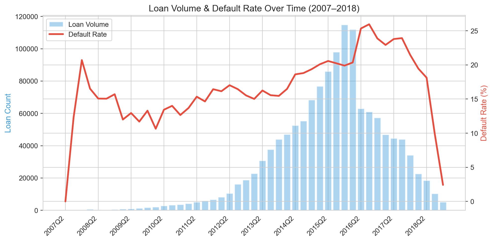{width=85%}

## 4.2 Key Feature Distributions

**Loan grade** is the most immediately informative categorical feature. Figure 2 shows default rates increasing monotonically from Grade A (5.3%) to Grade G (34.6%), confirming that LendingClub's internal risk grading captures meaningful default risk.

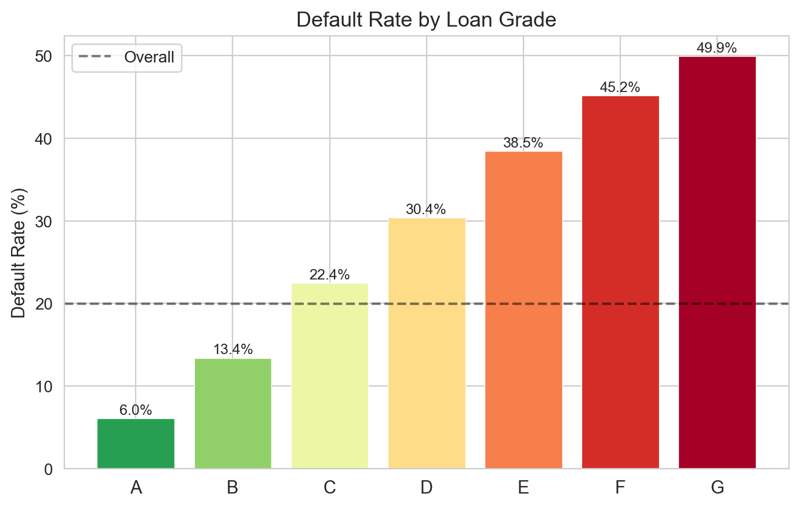{width=58%}

Figure 3 shows the distributions of interest rate and FICO score split by default status. Charged-off loans concentrate at higher interest rates and lower FICO scores, with substantial but incomplete class separation.

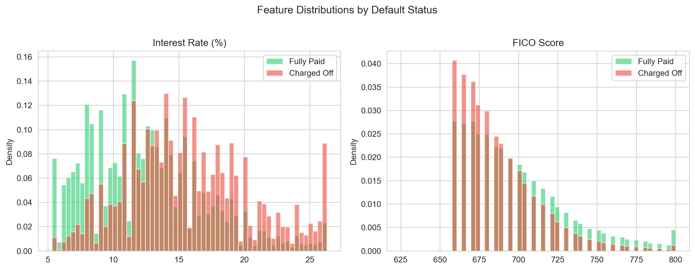{width=88%}

## 4.3 Feature Interactions and Correlations

Figure 4 presents the FICO × Interest Rate interaction heatmap, revealing default rates as high as 47% in the high-rate / low-FICO corner and as low as 2% in the low-rate / high-FICO corner. This two-way interaction is substantially more predictive than either feature alone.

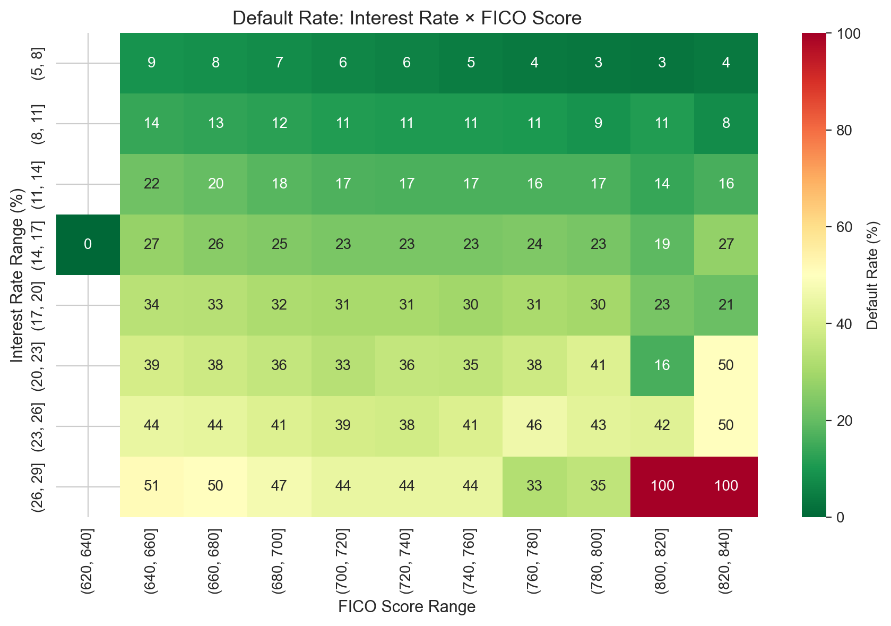{width=65%}

Figure 5 ranks features by Pearson correlation with default. `int_rate` and `sub_grade` show the strongest positive correlations, while `fico_range_low` and `credit_age_months` show the strongest negative correlations.

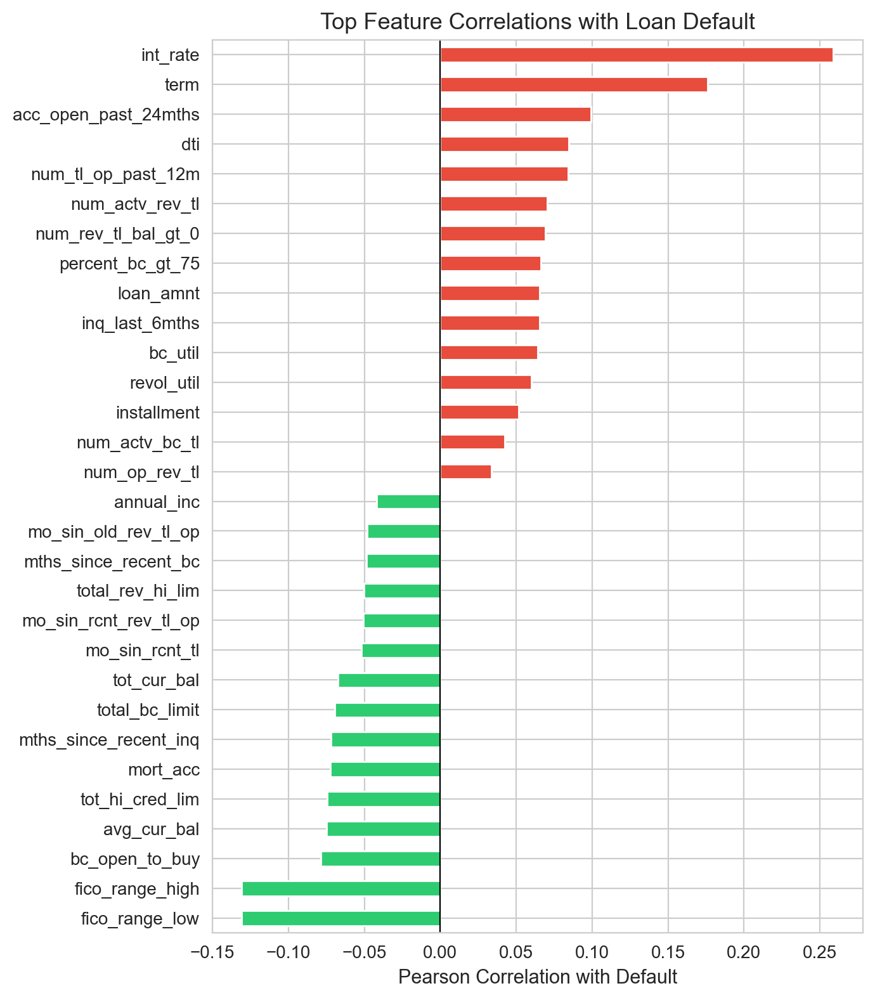{width=55%}

## 4.4 Unsupervised Learning

We apply three unsupervised techniques to probe the dataset's latent structure.

### PCA (Principal Component Analysis)

PCA on the 60+ numeric features reveals that **29 components** are needed to capture 90% of the variance, and **40 components** for 95% (Figure 6). This indicates high intrinsic dimensionality — the default risk signal is distributed across many features rather than concentrated in a few. The 2D PCA projection shows extensive class overlap, confirming that default prediction is inherently difficult.

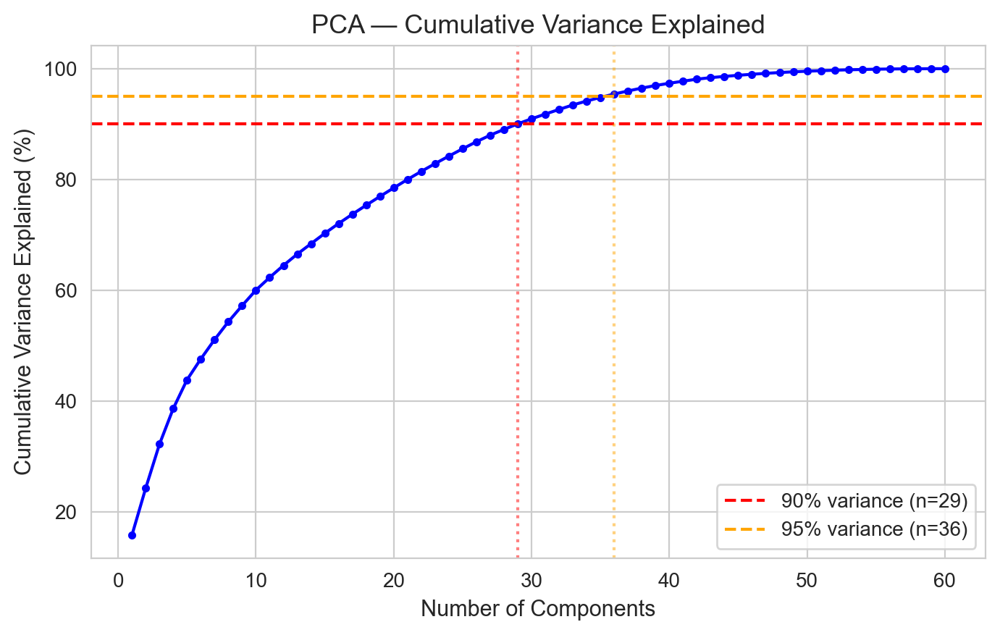{width=60%}

### K-Means Clustering (k=5)

K-Means clustering (k=5, chosen by elbow method) produces clusters with meaningfully different default rates ranging from ~10% to ~35% (Figure 7), indicating that K-Means can segment borrowers into risk tiers — though clusters overlap heavily in PCA space.

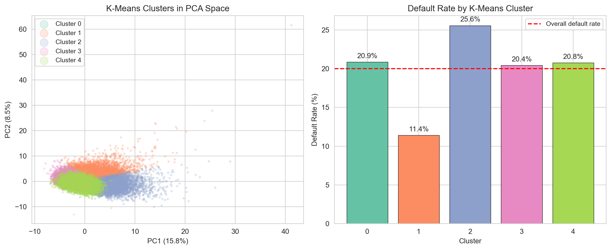{width=88%}

### t-SNE

t-SNE visualization (Figure 8) on a 10,000-sample subset reveals local groupings but confirms extensive class overlap. The K-Means clusters map onto visible t-SNE neighborhoods, suggesting the unsupervised structure captures real borrower segments, but the default signal remains diffuse.

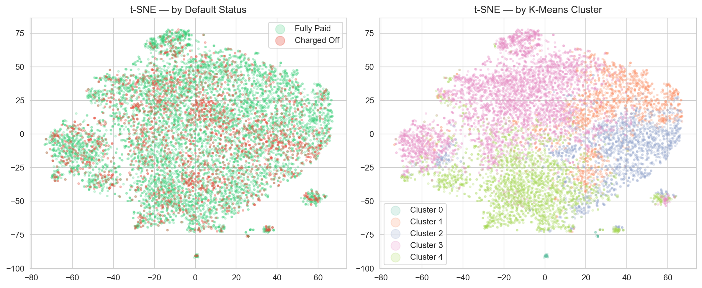{width=88%}

**Unsupervised learning takeaway**: The data has real structure (clusters differ in default rate, PCA captures gradients), but classes are not linearly separable. This motivates nonlinear models (RF, XGBoost, NN) alongside a linear baseline.

# 5. Feature Engineering Process and Justification

Feature engineering is split across Notebooks 03 (deterministic transforms) and 04 (data-dependent transforms fit on training data only) to prevent data leakage.

## 5.1 Deterministic Transforms

| Transform | Features | Rationale |
|:----------|:---------|:----------|
| FICO merge | `fico_avg` = mean of `fico_range_low` and `fico_range_high` | The two FICO bounds are always 4 points apart; a single average is cleaner |
| Ratio features | `loan_to_income`, `installment_to_income`, `revol_bal_to_income`, `open_acc_ratio` | Domain-driven ratios that normalize absolute values by income or credit capacity |
| Log transforms | `log_annual_inc`, `log_revol_bal`, `log_tot_cur_bal` | Reduces right skew in heavily skewed distributions |
| Ordinal encoding | `sub_grade` → 1–35 (A1=1, G5=35) | Preserves the natural ordinal risk ordering |
| One-hot encoding | `home_ownership` (3 levels), `purpose` (9 levels), `verification_status` (3 levels) | Converts nominal categoricals to binary indicators |

: Deterministic feature transforms applied in Notebook 03.

## 5.2 Leak-Free Transforms

These transforms are fit exclusively on training data and applied to validation/test sets:

1. **Target encoding** (`addr_state`): Each state is mapped to its smoothed default rate in the training set, using additive smoothing to regularize low-count states.
2. **Near-zero-variance (NZV) filter**: Removes 7 features where >95% of values are a single category.
3. **High-correlation filter**: Removes 9 features with |r| > 0.90 to another feature (retaining the one with higher target correlation).
4. **StandardScaler**: Centers and scales all features to zero mean and unit variance.

**Final feature set**: 73 features. The two-notebook architecture ensures that no information from the validation or test sets leaks into preprocessing.

# 6. Supervised Modeling

## 6.1 Temporal Train/Validation/Test Split

We use a **temporal split** rather than random splitting to simulate real-world deployment, where models are trained on historical data and predict future loans:

| Split | Period | Loans | Default Rate |
|:------|:-------|------:|:-------------|
| Train | Before July 2015 | 613,804 | 17.9% |
| Validation | July 2015 – June 2016 | 212,800 | 20.1% |
| Test | July 2016 onward | 518,706 | 22.4% |

: Temporal train/validation/test split.

The increasing default rate across splits reflects real temporal drift — later loan vintages have higher default rates, making this a more challenging and realistic evaluation than random CV.

## 6.2 Models Trained

We train four distinct supervised models, each with hyperparameter tuning via 3-fold temporal cross-validation:

**1. Logistic Regression (Baseline)**: ElasticNet regularization with `class_weight='balanced'`. Hyperparameters: C=0.01, l1\_ratio=1.0 (pure Lasso). 70/73 non-zero coefficients. 

**2. Random Forest**: 500 trees with balanced class weights. Tuned via randomized search (30 configurations): max\_depth=None, min\_samples\_leaf=8, max\_features=sqrt, max\_samples=0.7, criterion=entropy.

**3. PyTorch Neural Network**: MLP with architecture [512, 256, 128, 64], BatchNorm, Dropout (0.4), and early stopping on validation ROC-AUC. Searched 5 architectures; best: `large_high_drop` (204,033 parameters, 25 epochs).

**4. XGBoost**: Gradient boosting with 700 trees, max\_depth=4, learning\_rate=0.01, scale\_pos\_weight=4.0. Tuned via randomized search (40 configurations).

## 6.3 Post-Training Pipeline

### Isotonic Calibration

All four models use `class_weight='balanced'` or `scale_pos_weight` to handle class imbalance, which distorts predicted probabilities. We apply **isotonic calibration** (fit on one half of the validation set) to restore well-calibrated probabilities:

| Model | Brier (Raw) | Brier (Calibrated) | Improvement |
|:------|:-----------:|:------------------:|:-----------:|
| Logistic Regression | 0.2131 | 0.1583 | 25.7% |
| Random Forest | 0.1624 | 0.1572 | 3.2% |
| Neural Network | 0.2104 | 0.1569 | 25.4% |
| XGBoost | 0.1978 | 0.1571 | 20.6% |

: Isotonic calibration results (Brier score, lower is better).

### F2-Optimized Decision Thresholds

The default threshold of 0.5 produces very low recall (9–13%) because calibrated probabilities for the minority class rarely exceed 0.5. We optimize the decision threshold on the second half of the validation set using the **F2 score**, which weights recall twice as heavily as precision. This reflects the business reality that **missing a default is far costlier than a false alarm** — a defaulted loan loses principal, while a rejected good loan only loses potential interest.

Optimized thresholds: LR=0.120, RF=0.140, NN=0.125, XGBoost=0.125.

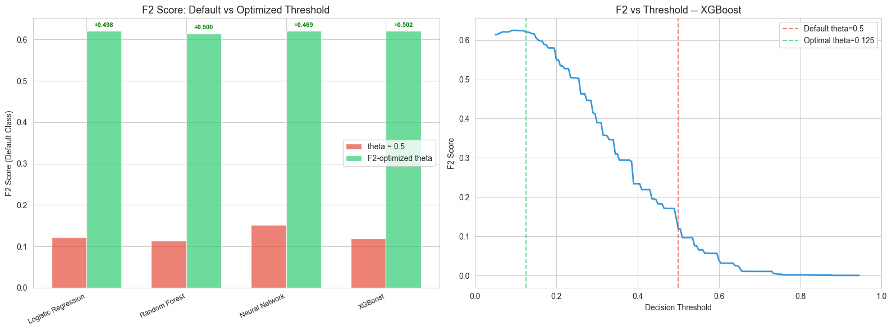{width=88%}

# 7. Model Comparison and Selection

## 7.1 Performance Metrics

We evaluate all four calibrated models at their F2-optimized thresholds on the held-out test set:

| Model | Threshold | Precision | Recall | F1 | F2 | AUC-ROC | PR-AUC | Brier |
|:------|:---------:|:---------:|:------:|:--:|:--:|:-------:|:------:|:-----:|
| Logistic Regression | 0.120 | 0.291 | **0.865** | 0.436 | 0.621 | 0.710 | 0.392 | 0.158 |
| Random Forest | 0.140 | **0.309** | 0.817 | **0.448** | 0.615 | **0.714** | 0.403 | 0.157 |
| Neural Network | 0.125 | 0.302 | 0.844 | 0.444 | 0.621 | 0.717 | 0.403 | **0.157** |
| **XGBoost** | **0.125** | 0.299 | 0.850 | 0.442 | **0.621** | 0.713 | **0.404** | 0.157 |

: Test-set performance of all four models at F2-optimized thresholds. Bold indicates best per column.

XGBoost achieves the best F2 score (0.6207) and PR-AUC (0.4039) while training in only 29 seconds — 5× faster than Random Forest and 3× faster than the Neural Network.

## 7.2 ROC and Precision-Recall Curves

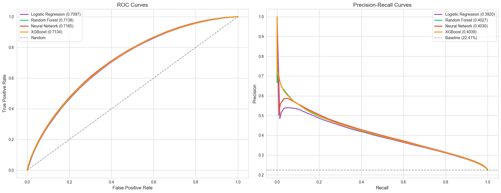{width=88%}

The ROC curves show similar performance (AUC 0.710–0.717), but the PR curves — more informative for imbalanced problems — reveal slightly better performance for XGBoost and the Neural Network.

## 7.3 Confusion Matrices

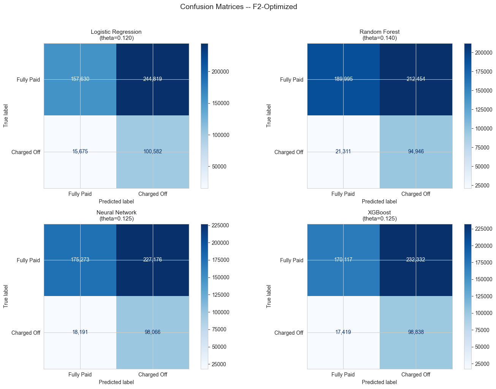{width=88%}

All models achieve 82–87% recall at the cost of 50–70% false positive rates — an intentional trade-off under the cost-asymmetric F2 objective.

## 7.4 Calibration

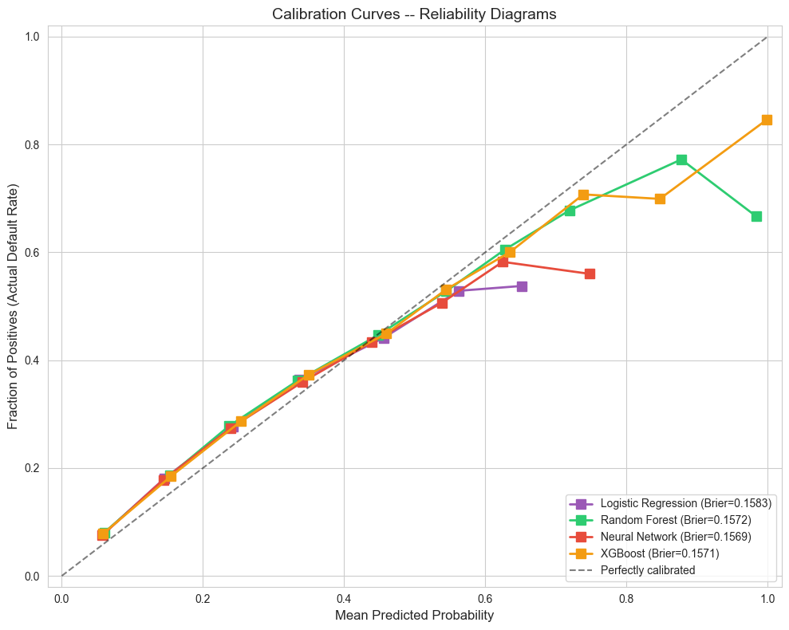{width=62%}

After isotonic calibration, all models produce well-calibrated probabilities (Brier 0.157–0.158), closely tracking the diagonal.

## 7.5 Feature Importance and SHAP Analysis

Figure 13 compares normalized feature importances across all four models. The consensus top features are: `sub_grade`, `term`, `fico_avg`, `dti`, `int_rate`, `loan_to_income`, and `revol_util`.

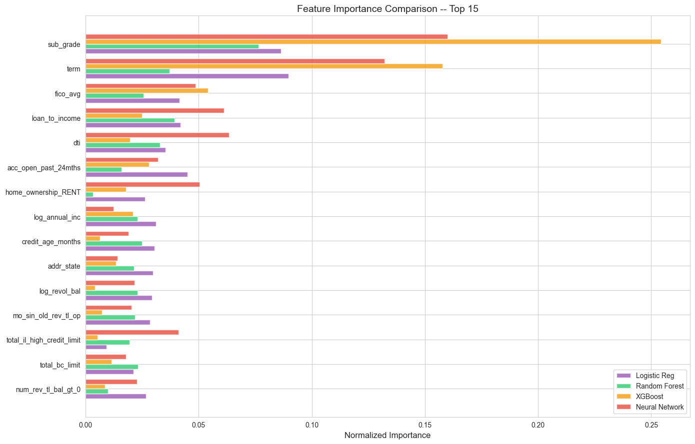{width=60%}

SHAP analysis provides deeper interpretability. Figure 14 shows global importance by mean |SHAP value|, confirming `sub_grade` as the dominant predictor. Figure 15 (beeswarm) reveals effect directions: higher `sub_grade` (worse grade) increases default risk, while higher `fico_avg` decreases it.

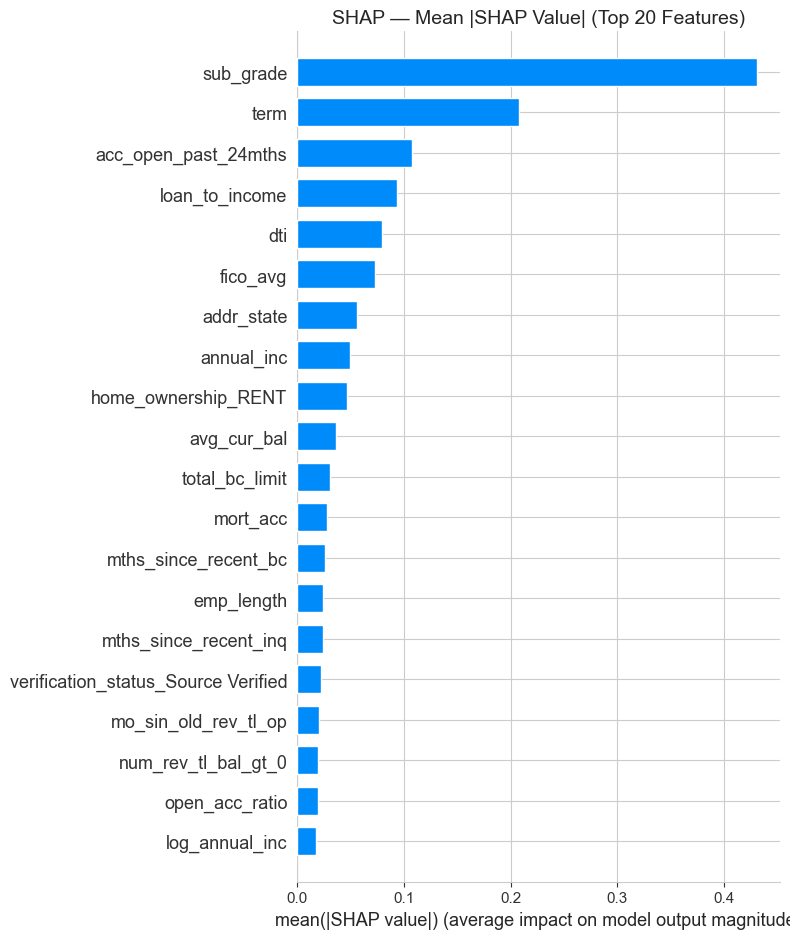{width=50%}

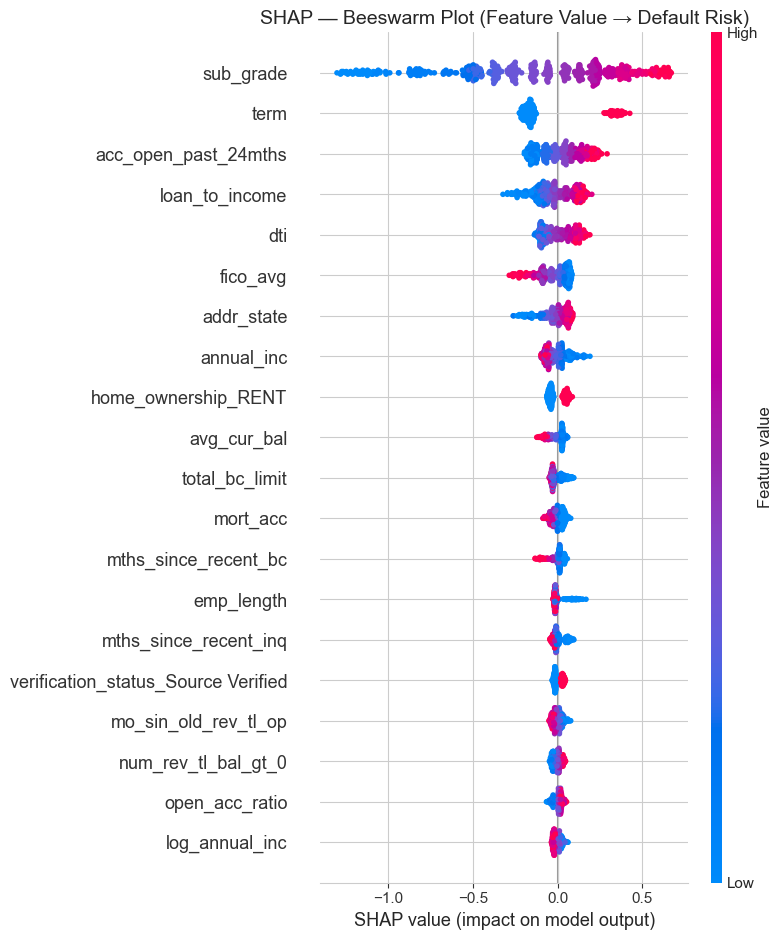{width=65%}

## 7.6 Final Model Selection

We select **XGBoost** as the final model based on:

1. **Best F2 and PR-AUC**: XGBoost achieves the highest F2 (0.6207) and PR-AUC (0.4039) on the test set, the two metrics most aligned with our cost-asymmetric objective.
2. **Fast training**: 29 seconds — 5× faster than RF, enabling rapid iteration and retraining.
3. **Good calibration**: Brier score of 0.1571, near-best among all models.
4. **Medium interpretability**: SHAP values provide feature-level explanations for individual predictions, unlike the Neural Network (black box).
5. **Robustness to right-censoring**: Performance degrades only slightly (-0.005 PR-AUC) when excluding potentially right-censored 60-month loans from the test set.

## 7.7 Additional Analyses

### Application-Time vs. Investor Model

We compared the full model (73 features, including `sub_grade`) against an application-time model (72 features, excluding `sub_grade`). The `sub_grade` feature adds +0.012 PR-AUC, confirming that LendingClub's internal grading captures meaningful risk signal beyond the raw borrower features. For investor use cases where `sub_grade` is available at decision time, the full model is preferred.

### Right-Censoring Sensitivity

Approximately 10.8% of test-set loans are 60-month loans originated in 2017+ that may not have had sufficient time to default. Excluding these "potentially immature" loans reduces the test-set default rate from 22.4% to 21.5% but does not change model rankings or conclusions.

### Prediction Agreement

Across the four models, 82.5% of test-set predictions agree (all four models predict the same class). The majority-vote ensemble achieves F2=0.6244, slightly above any individual model, suggesting complementary strengths.

# 8. Summary of Key Findings

1. **Leak-free preprocessing is critical**: Fitting StandardScaler, target encoding, and feature selection on training data only prevents optimistic bias. Our temporal split reveals a harder problem (22.4% test default rate vs. 17.9% train) that random CV would mask.
2. **Isotonic calibration is essential**: Class weights distort probabilities by 20–25% (Brier score). Calibration restores reliability for threshold optimization.
3. **F2-optimized thresholds dramatically improve recall**: Moving from 0.5 to F2-optimized thresholds (0.12–0.14) increases recall from 9–13% to 82–87%, catching 7× more defaults.
4. **Sub-grade is the single strongest predictor**: LendingClub's internal grading (A1–G5) consistently dominates across all models and SHAP.
5. **Model performance is tightly clustered**: All four models achieve similar F2 (0.615–0.621) and PR-AUC (0.392–0.404), suggesting the ceiling is set by problem difficulty, not model architecture.
6. **The problem is fundamentally hard**: Extensive class overlap in PCA, t-SNE, and density plots confirms many defaulting and non-defaulting borrowers are statistically indistinguishable at origination.

# 9. Challenges Faced and Future Recommendations

**Challenges**: (1) The 4:1 class imbalance required class weights, calibration, and threshold optimization rather than naive accuracy. (2) Temporal drift — default rates rise from 17.9% (train) to 22.4% (test) — makes temporal splits essential but harder to optimize. (3) Among 151 raw columns, many post-origination features would leak the outcome; identifying and removing all 19 leakage columns required careful domain analysis. (4) Right-censoring of immature 60-month loans may deflate observed default rates. (5) Class weights distort predicted probabilities, requiring isotonic calibration that consumes part of the validation set.

**Future work**: (1) Macroeconomic indicators (unemployment, federal funds rate) as time-varying features to address temporal drift. (2) Stacked ensemble — the 82.5% agreement rate suggests complementary error patterns. (3) Direct expected-cost minimization using loss-given-default estimates. (4) Periodic retraining on recent outcomes. (5) NLP on the loan description field (`desc`, currently dropped).

# 10. Interactive Web Application

As a project enhancement, we deployed a **Python Shiny web application** at [https://zd2372.shinyapps.io/loan-default-predictor/](https://zd2372.shinyapps.io/loan-default-predictor/) that allows users to adjust 12 borrower parameters and receive real-time default predictions from the calibrated Logistic Regression and XGBoost models. The app replicates the exact preprocessing pipeline from Notebook 04 (target encoding, derived features, one-hot encoding, StandardScaler) and applies the F2-optimized thresholds. The Random Forest (~1.8 GB serialized) and Neural Network (requires PyTorch ~800 MB) were excluded to fit within free-tier hosting limits; Logistic Regression and XGBoost total ~1.2 MB.

# 11. Team Contributions

| Member | Contribution |
|:-------|:-------------|
| Zhewei Deng (zd2372) | Data cleaning, feature engineering, interactive web app development and deployment, project report |
| Lucas Meadows (lm3774) | XGBoost implementation and tuning |
| Cecilia Zang (cz2957) |PyTorch MLP and tuning with BatchNorm, Dropout, early stopping  |
| Carrie Yan Yin Feng (cf3084) | Random Forest modeling and hyperparameter tuning |

: Team member contributions.

All team members are equally contributed in this project.

